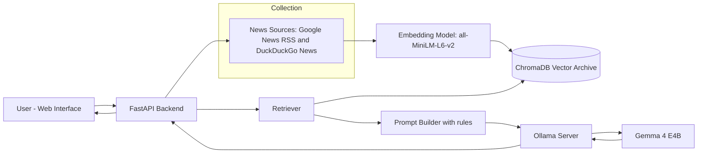
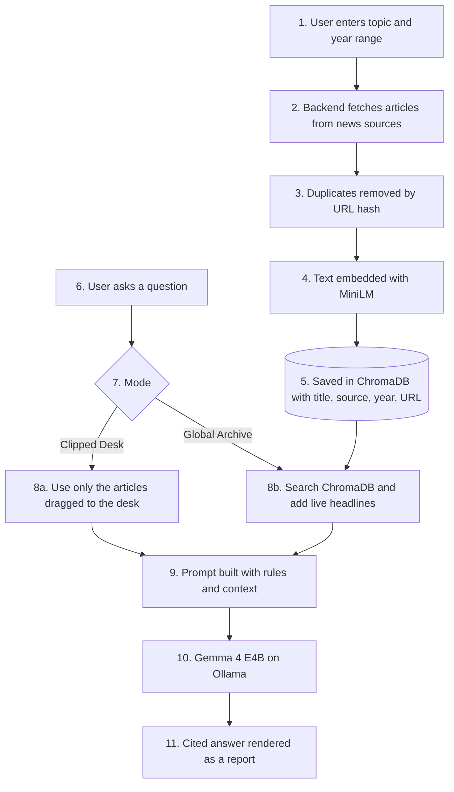
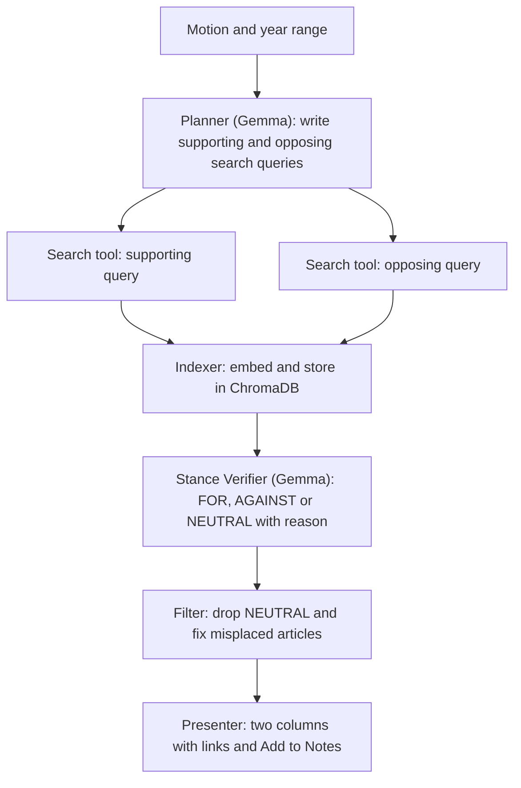

NewsByte: Digital Archive and Debate Synthesis Hub

Hacktober Fest Open Source AI Hackathon | Qualifier Submission | Team BYTE_ME

---

1. Project Name

NewsByte is a local, open-source AI research desk that collects news articles, organizes them, and uses Gemma 4 E4B running on Ollama to synthesize them and to separate opposing viewpoints on any topic with the help of relevant articles.

---

2. Problem Statement

Best Use of Gemma 4 / Gemma 4 Open-Source
Build a functional project that makes meaningful use of Google's lightweight Gemma 4 open-weight model. The project should demonstrate a practical use of Gemma 4 rather than functioning as a simple API demonstration.
What the team needs to build
•	Choose a clear problem that can benefit from Gemma 4.
•	Use Gemma 4 meaningfully in the core workflow of the application.
•	The project may work with text, images, or multimodal inputs where appropriate.
•	Build a functional prototype or system that demonstrates the model's contribution to the solution.
•	Clearly explain the input, processing flow, model interaction, and final output.
Important expectations
•	Gemma 4 should have a meaningful role in the system rather than being included only to satisfy the challenge.
•	The project should go beyond a superficial wrapper around the model.
•	Teams should explain why Gemma 4 was selected and what part of the problem it solves.
•	The final system should demonstrate actual engineering, integration, and a clear user-facing or technical outcome.
Possible directions
Teams may explore multimodal assistants, productivity tools, learning applications, creative tools, document understanding, community-focused applications, or other focused AI systems where Gemma 4 provides a meaningful capability.
Expected final outcome
A working project that clearly demonstrates a useful application of Gemma 4 and explains how the model contributes to the system.

--

3. Project Overview

NewsByte is a web application with four connected workspaces:

| Workspace | Purpose |
|---|---|
| **I. Global Wire** | Search a topic within a year range and fetch recent and historical news articles. |
| **II. Editor's Desk** | Drag and drop articles into a working set, return them to the feed, and keep a Research Notebook. |
| **III. Synthesis Engine** | Ask Gemma 4 E4B a question. It answers only from the clipped articles, or from the stored archive plus live news, and cites its sources. |
| **IV. Debate and Perspective Room** | Enter a motion and a year range. The system shows articles **For** and **Against** the motion in two columns. |
---

4. Target Users / Use Case

User	                          Use case

1.Students and debaters:	       Prepare both sides of a motion with real news evidence.

2.Researchers and journalists:	 Collect and compare coverage of a topic over a period of years, with notes.

3.Curious readers:	             Understand a controversial issue without staying inside one viewpoint.

4.Privacy-conscious:             users	Use AI on their research without sending questions to a cloud AI service.

Example: a debate student enters the motion "Should social media be restricted for children?", sets the years 2023 to 2026, and gets supporting and opposing articles in two columns. She clips the best ones to the Editor's Desk, adds notes, and asks the Synthesis Engine to compare the strongest arguments, with sources.

--

5. Objectives
   
1.Build a source-grounded news research assistant using only open-source AI.

2.Let a user go from a topic to a collected, annotated set of articles in a few minutes.

3.Give answers that name their sources and stay inside the supplied articles.

4.Present both sides of a motion fairly, with the model verifying each article's stance.

5.Keep the AI neutral on disputed issues and clearly separate facts from opinions.

6.Run the language model locally on a single laptop with Gemma 4 E4B

7.Keep the architecture modular so sources, models and features can be swapped or extended.

---

6. Target Users / Use Case
| User | Use case |
|---|---|
| **Students and debaters** | Prepare both sides of a motion with real news evidence. |
| **Researchers and journalists** | Collect and compare coverage of a topic over a period of years, with notes. |
| **Curious readers** | Understand a controversial issue without staying inside one viewpoint. |
| **Privacy-conscious users** | Use AI on their research without sending questions to a cloud AI service. |

---

7. Open-Source AI Technology Selected
   
| Component | Role | Type |
|---|---|---|
| **Gemma 4 E4B** | Main language model: grounded answers, comparison, stance checking, query planning | Open-weight LLM / Small Language Model (about 4.5B effective parameters, 128K token context) |
| **Ollama** | Local inference server that runs Gemma 4 E4B and serves a REST API on `localhost:11434` | Open-source inference framework |
| **all-MiniLM-L6-v2** (sentence-transformers) | Converts article text into embeddings for search by meaning | Open-source embedding model |
| **ChromaDB** | Stores embeddings and metadata on disk and performs similarity search | Open-source vector database |
---

8. Why This Technology Was Selected

Gemma 4 E4B

*It is an "effective 4B" edge model, small enough to run on a developer laptop while still strong at reading, summarizing and following instructions.
*Its 128K token context window lets it read several articles in one request.
*It follows structured instructions well, which the project needs for source citations, strict neutrality rules and `FOR` / `AGAINST` / `NEUTRAL` labels.
*Its weights are open, so anyone can reproduce and inspect the whole system.

Ollama

*It installs quickly, manages the model download, and exposes a simple HTTP API that the FastAPI backend calls.
*It keeps the model loaded between requests, which speeds up later answers.

all-MiniLM-L6-v2 and ChromaDB

*Both are small and fast on CPU, so retrieval does not compete with the language model for resources.
*ChromaDB saves to a local folder, so the archive survives restarts with no separate database server.

Why an open-source, local approach suits this project: research questions and notes can be private or sensitive. Running the model locally means no API keys to leak, no per-request cost, no usage limits, and complete transparency about how an answer was produced.

---

9. AI's Role in the System

| Task | What the AI does |
|---|---|
| Semantic retrieval | The embedding model finds stored articles by meaning, not only by keyword. |
| Grounded synthesis | Gemma 4 E4B answers using only the supplied article context and cites the source of each claim. |
| Neutrality guardrail | When asked for a personal opinion on a dispute, Gemma 4 E4B declines and offers factual summaries of the articles instead. |
| Query planning for debates | Gemma 4 E4B turns a motion into separate "supporting" and "opposing" search queries. |
| Stance verification | Gemma 4 E4B labels each fetched article `FOR`, `AGAINST` or `NEUTRAL` for the motion, with a one-line reason, so wrongly placed articles are removed or moved. |
| Comparison | Gemma 4 E4B summarizes where the clipped articles agree and disagree. |

---

10. System Architecture

The system has three layers:
*Presentation layer: an HTML, CSS and JavaScript interface with four workspaces. Markdown from the model is rendered as a formatted report.
*Application layer: a FastAPI service that coordinates news collection, retrieval, prompt building and responses.
*AI and data layer: Ollama with Gemma 4 E4B for reasoning, and ChromaDB with an embedding model for memory and retrieval.

---

11. Component-Level Architecture

| Component | Responsibility | Input | Output |
|---|---|---|---|
| Web Interface | Search forms, drag and drop desk, notebook, chat box, debate columns | User actions | HTTP requests |
| `/search_news` route | Fetch and store articles for a topic and year range | Topic, from-year, to-year | Article cards |
| `/search_debate` route | Run the debate pipeline for a motion | Motion, from-year, to-year | `for_articles` and `against_articles` lists |
| `/chat` route | Answer a question in "Clipped Desk" or "Global Archive" mode | Question, clipped context, mode | Cited answer |
| News Fetcher | Query Google News RSS with date operators, fall back to DuckDuckGo News and text search | Query, years | Raw article list |
| Article Store | Embed and save articles in ChromaDB with metadata, avoiding duplicates by URL hash | Article list | Stored records |
| Retriever | Semantic search over the archive, plus top live headlines | Question | Ranked passages |
| Prompt Builder | Combines the rules (source dependence, citations, neutrality) with the context | Passages, question | Final prompt |
| Ollama and Gemma 4 E4B | Generates answers, query plans and stance labels | Prompt | Text or JSON |
| Stance Verifier | Calls Gemma to label each debate article and filters mismatches | Motion, article snippet | `FOR`, `AGAINST` or `NEUTRAL` with reason |
| Response Formatter | Cleans output and attaches source links | Model output | Display-ready result |

---
12. Data / Information Flow

---

## 13. Agentic Workflow

The Debate and Perspective Room runs as a multi-step agent pipeline. Each step has one job, and Gemma 4 E4B handles the reasoning steps.

| Step | Tool | Uses Gemma? |
|---|---|---|
| Planner | Prompt to Gemma 4 E4B | Yes |
| Search | Google News RSS and DuckDuckGo News | No |
| Indexer | Embedding model and ChromaDB | No |
| Stance Verifier | Prompt to Gemma 4 E4B with a strict JSON answer | Yes |
| Filter and Presenter | Backend code | No |

The Synthesis Engine follows a shorter loop: retrieve context, build a rule-based prompt, generate a cited answer. Keeping orchestration in our own code and using Gemma only for reasoning steps keeps the workflow predictable and fast on a local model.

---

## 14. Technology Stack

| Layer | Technology |
|---|---|
| **Frontend** | HTML, CSS, JavaScript, marked.js (renders model output as formatted text) |
| **Backend** | Python, FastAPI, Uvicorn, Pydantic |
| **LLM** | Gemma 4 E4B |
| **LLM runtime** | Ollama (REST API on port 11434) |
| **Embeddings** | sentence-transformers, model `all-MiniLM-L6-v2` |
| **Vector database** | ChromaDB (persistent local storage) |
| **News collection** | Google News RSS (XML parsing with the Python standard library), duckduckgo-search |
| **Web scraping** | Requests, BeautifulSoup4 |
| **Utilities** | hashlib for duplicate detection |

---

## 15. Expected Features

1. **Topic search with year filter:** fetch news by keyword and from-year to to-year.
2. **Article cards:** title, source, date, snippet and a link to the original article.
3. **Editor's Desk:** drag and drop cards to build a working set, and return cards to the feed.
4. **Research Notebook:** add articles to notes with one click, and clear the notebook.
5. **Persistent archive:** every fetched article is saved locally and searchable by meaning.
6. **Two answer modes:** answer from the clipped desk only, or from the global archive plus live headlines.
7. **Cited answers:** every answer names its sources and stays within the supplied articles.
8. **Neutrality guardrail:** the AI refuses to give personal opinions on disputed issues and offers factual summaries instead.
9. **Debate and Perspective Room:** For and Against columns for any motion, with the model checking each article's stance.
10. **Readable output:** answers rendered as headings and lists, and clear error messages when the backend or model is not running.

---

## 16. Implementation Approach

The work is divided into phases so that a working demo exists early and extra features come afterwards.

| Phase | Work | Result |
|---|---|---|
| **1. Local AI setup** | Install Ollama, pull `gemma4:e4b`, test it from Python with a local request | Model answers through the local API |
| **2. Backend core** | FastAPI app serving the page and the `/search_news`, `/search_debate` and `/chat` routes | Frontend and backend connected |
| **3. News collection** | Google News RSS with year operators, DuckDuckGo fallback, full-text extraction with BeautifulSoup when a page allows it | Rich article records |
| **4. Vector memory** | Embed articles, store them in ChromaDB with year metadata, remove duplicates by URL hash | Archive searchable by meaning |
| **5. Synthesis Engine** | Retriever, rule-based prompt, two answer modes, citations, neutrality rule | Cited answers from Gemma 4 E4B |
| **6. Debate Room** | Query planner, stance verifier with JSON output, filtering, two-column display | Verified For and Against columns |
| **7. Interface** | Drag and drop, notebook, loading states, formatted output | Complete demo flow |
| **8. Tuning and testing** | Test several topics, tune prompts and context size, keep the model loaded, shorten answers | Reliable demo |

**Local performance plan:** keep the model loaded between requests (`keep_alive`), limit the context size and answer length, and send only the top few passages to the model.

**Fallback plan:** if live news fetching fails or is rate limited, the app uses articles already stored in the archive, plus a small set of sample articles prepared for the demo.

---

## 17. Expected Final Output

A working web application running locally, which a judge can use in a live demo:

- Search a topic and year range and see fetched articles.
- Drag articles into the Editor's Desk and add them to the Research Notebook.
- Ask a question in "Clipped Desk" or "Global Archive" mode and receive a cited answer from Gemma 4 E4B.
- Enter a debate motion and see articles sorted into **For** and **Against** with the stance checked by the model.
- A public repository with setup steps: install Ollama, run `ollama pull gemma4:e4b`, install the Python dependencies, start the FastAPI server, and open the page in a browser.

---

## 18. Future Scope / Scalability

- **More sources:** add more RSS feeds, regional-language outlets and open news datasets.
- **Multilingual support:** use multilingual embeddings so the archive can include Indian-language news.
- **Larger Gemma 4 models:** switch the model name in one setting when stronger hardware is available.
- **Source credibility and bias indicators:** show how coverage differs by outlet and over time.
- **Timeline view:** show how arguments for and against a topic change across years.
- **Export:** generate a research brief or a debate case file from the desk and notebook.
- **Multimodal input:** use Gemma's image and audio abilities for news photos, charts or recorded speeches.
- **Team and classroom use:** containerize with Docker and run ChromaDB in server mode with shared archives.

---

## 19. Open-Source Dependencies / Components

| Dependency | Purpose |
|---|---|
| Gemma 4 E4B | Language model for synthesis, query planning and stance verification |
| Ollama | Local model runtime and API |
| FastAPI | Backend web framework |
| Uvicorn | ASGI server for FastAPI |
| Pydantic | Request validation |
| ChromaDB | Local vector database |
| sentence-transformers (all-MiniLM-L6-v2) | Text embeddings |
| duckduckgo-search | News and web search fallback |
| BeautifulSoup4 | HTML parsing and text extraction |
| Requests | HTTP client for news feeds, pages and the Ollama API |
| marked.js | Renders model output as formatted text in the browser |
| Python standard library | XML (RSS) parsing, URL handling, hashing |

---

## 20. Expected Challenges and Mitigation

| Challenge | Mitigation |
|---|---|
| **Slow responses from a local model** | Keep the model loaded, cap context and answer length, retrieve only the top passages, and show a clear loading state. |
| **Model may state things not in the articles** | Answer only from supplied context, require citations in the prompt, and keep answers short. |
| **Stance labels can be wrong or biased** | Use a strict prompt with JSON output, include a `NEUTRAL` option, show the reason, and allow users to open the source. |
| **Search keywords for "for" and "against" can return irrelevant articles** | Let Gemma plan better queries and verify every article before it is shown. |
| **News sites block scraping or rate-limit searches** | Use two search sources, store results in the archive, and keep sample articles for the demo. |
| **Short snippets limit answer quality** | Extract full article text where allowed and chunk it before embedding. |
| **Duplicate or low-quality articles** | Remove duplicates by URL hash and skip pages with very little text. |
| **Hardware limits** | Run one model, use a CPU embedding model, and document the minimum memory needed. |
| **Controversial topics** | Present both sides with sources, refuse personal opinions, and label outputs as AI-generated. |
| **Limited time in the hackathon** | Build in phases with a working demo early, and keep optional features for the end. |
